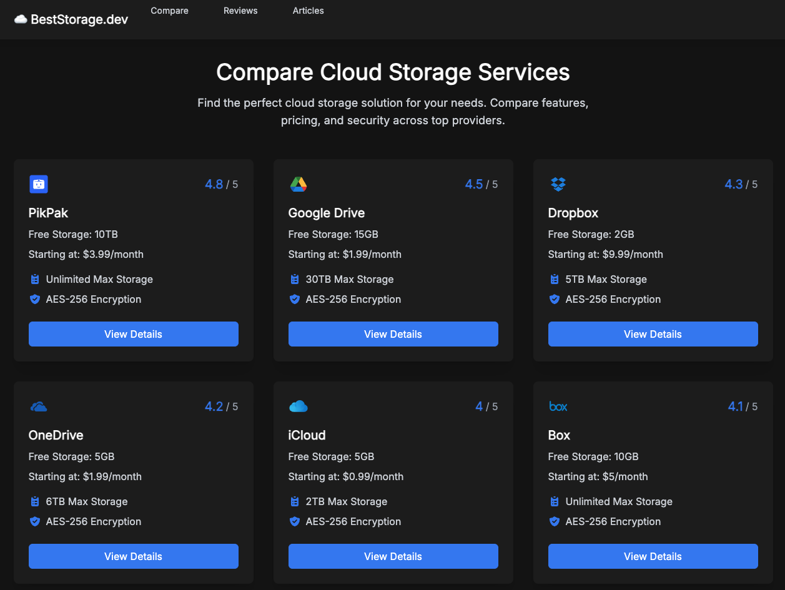

# Cloud Storage Comparison Website

Link: https://beststorage.dev/

Git: https://github.com/temaprint/BestStorage.dev.git



A modern, responsive website built with Astro.js and Tailwind CSS that helps users compare different cloud storage services, read reviews, and stay informed about cloud storage solutions.

## Features

### 1. Service Comparison
- Detailed comparison of cloud storage providers
- Rating system and user reviews
- Comprehensive feature comparison matrix
- Pricing information and plans
- Security details and platform support
- Individual service pages with in-depth information

### 2. Reviews System
- User reviews for each service
- Rating display with average calculations
- Date-stamped comments
- Top-rated services highlighting
- Review sorting and filtering

### 3. Articles Section
- Informative blog posts about cloud storage
- Latest articles showcase
- Topics covering:
  - Security best practices
  - Service comparisons
  - Business solutions
  - Usage tips and guides

## Technology Stack

- **Framework**: [Astro.js](https://astro.build) - Static site generation
- **Styling**: [Tailwind CSS](https://tailwindcss.com) - Utility-first CSS
- **Typography**: Inter font family
- **Type Safety**: TypeScript
- **Content**: Markdown for articles

## Project Structure

```
/
├── public/
│   └── logos/        # Service provider logos
├── src/
│   ├── components/   # Reusable UI components
│   ├── layouts/      # Page layouts
│   ├── pages/        # Route components
│   │   ├── articles/ # Blog posts
│   │   └── service/  # Service pages
│   ├── data/         # Service data
│   └── types/        # TypeScript definitions
```

## Key Components

### Service Cards
- Visual representation of each service
- Quick access to key features
- Rating display
- Pricing information
- Direct links to detailed pages

### Comparison Table
- Side-by-side feature comparison
- Sortable columns
- Highlight differences
- Category grouping

### Article System
- Markdown-based content
- Responsive layout
- Code syntax highlighting
- Category organization

## Design Features

- Dark theme optimized for readability
- Responsive design for all devices
- Card-based layout for clear information hierarchy
- Interactive elements with hover states
- Consistent typography using Inter font
- Accent colors for important information
- Clean and modern interface

## Performance

- Static site generation for fast loading
- Optimized images and assets
- Efficient data structures
- Clean, maintainable code
- Responsive design principles

## Getting Started

1. Clone the repository
2. Install dependencies:
   ```bash
   npm install
   ```
3. Start the development server:
   ```bash
   npm run dev
   ```
4. Build for production:
   ```bash
   npm run build
   ```

## Available Scripts

- `npm run dev` - Start development server
- `npm run build` - Build for production
- `npm run preview` - Preview production build
- `npm run astro` - Run Astro CLI commands

## Dependencies

```json
{
  "dependencies": {
    "astro": "^5.2.5",
    "@astrojs/tailwind": "^5.1.0",
    "@astrojs/ts-plugin": "^1.5.2",
    "tailwindcss": "^3.4.1",
    "@fontsource/inter": "^5.0.16",
    "@astrojs/markdown-remark": "^4.2.1"
  }
}
```

## Contributing

1. Fork the repository
2. Create a feature branch
3. Commit your changes
4. Push to the branch
5. Open a pull request

## License

This project is open source and available under the MIT License.